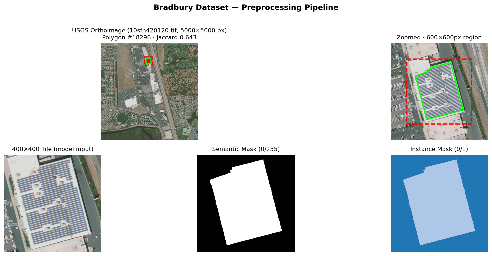

# Solar Panel Panoptic Segmentation

[](https://github.com/tuanmp/solar-panel-seg/actions/workflows/ci.yml)

End-to-end deep learning pipeline for panoptic segmentation of solar photovoltaic panels from satellite and aerial imagery. Built with PyTorch Lightning, HuggingFace Transformers (Mask2Former), Hydra, and MLflow.

## Features

- **Satellite API acquisition** — query Google Earth Engine (NAIP 1m) and Sentinel Hub (Sentinel-2 10m) via Python clients
- **Multi-dataset support** — BDAPPV (France, 21K masks) and Bradbury et al. (California, 20K annotations)
- **Mask2Former fine-tuning** — Swin transformer backbone with panoptic segmentation head, pre-trained on COCO
- **Panoptic quality metrics** — PQ, SQ, RQ, and mIoU evaluation
- **Experiment tracking** — Hydra config management + MLflow logging
- **Reproducible pipelines** — DVC for data versioning, seed control throughout

## Quick Start

```bash
# Install dependencies
uv sync --group dev

# Run tests (31 tests, no GPU needed)
uv run pytest

# Train (requires preprocessed data)
uv run python -m solar_seg.train --config-name experiment/bdappv_only
```

## Project Structure

```text
.
├── configs/
│   ├── data/           # BDAPPV / Bradbury dataset configs
│   ├── model/          # Swin-T, Swin-B, Swin-L variants
│   ├── trainer/        # Epochs, precision, accelerator
│   └── experiment/     # Compose data + model + trainer
├── src/solar_seg/
│   ├── data/
│   │   ├── acquisition/      # GEE + Sentinel Hub API clients
│   │   └── preprocessing/    # Mask converter, tiling, augmentations, dataset
│   ├── models/               # Mask2Former LightningModule
│   ├── evaluation/           # PQ/SQ/RQ metrics, visualization, ablations
│   ├── utils/                # Seed, reproducibility
│   └── train.py              # Hydra + MLflow training entry point
├── figures/                  # Pipeline visualization figure
├── notebooks/
│   ├── 01_eda.ipynb          # Dataset exploration
│   └── 02_results.ipynb      # Results analysis
├── scripts/                  # Download, preprocessing, visualization
└── tests/                    # 31 tests across all modules
```

## Data Pipeline

### Pre-built Datasets

| Dataset | Coverage | Images | Masks | Resolution | License |
|---------|----------|--------|-------|-----------|---------|
| [BDAPPV](https://zenodo.org/record/7358126) (Kasmi 2023) | France | 46K | 21K | 0.1-0.2m GSD | CC-BY 4.0 |
| [Bradbury](https://doi.org/10.6084/m9.figshare.3385780.v4) (2016) | California | 601 tiles | 19.8K | 0.3m GSD | CC0 |

### Preprocessing Pipeline

Raw 5000×5000 orthoimages are tiled into 400×400 crops centered on each annotation polygon, producing the model inputs, semantic masks, and instance masks:


*Generating pipeline figures: `uv run python scripts/visualize_bradbury_pipeline.py`*

Download and preprocess:

```bash
# BDAPPV (8.17 GB)
curl -L https://zenodo.org/api/records/7358126/files/bdappv.zip/content -o bdappv.zip
unzip bdappv.zip -d data/raw/bdappv

# Preprocess masks
python -c "
from solar_seg.data.preprocessing.mask_converter import bdappv_mask_to_labelmaps
from pathlib import Path
for mask in Path('data/raw/bdappv/bdappv').rglob('*/mask/*.png'):
    bdappv_mask_to_labelmaps(mask, Path('data/processed/bdappv'))
"
```

### Live API Acquisition

Acquire satellite imagery on demand:

```bash
# GEE — NAIP 1m aerial (US)
python -m solar_seg.data.acquisition gee --lat 37.77 --lon -122.42 --source naip

# Sentinel Hub — Sentinel-2 10m (global)
python -m solar_seg.data.acquisition sentinel --lat 48.85 --lon 2.35 --resolution 10
```

## Training

```bash
# Default: Swin-B, BDAPPV dataset
uv run python -m solar_seg.train

# Override any config value from CLI
uv run python -m solar_seg.train \
    --config-name experiment/bdappv_only \
    model=mask2former_swin_t \
    trainer.max_epochs=100 \
    data.batch_size=16

# View experiments
mlflow ui --backend-store-uri mlruns
```

## Evaluation

```python
from solar_seg.evaluation.metrics import panoptic_quality, mean_iou

metrics = panoptic_quality(
    pred_semantic, pred_instance,
    target_semantic, target_instance,
    num_classes=2,
)
# {"pq": 0.52, "sq": 0.68, "rq": 0.76}
```

## Configuration

All training parameters live in composable Hydra YAML configs under `configs/`:

| Group | Config | Description |
|-------|--------|-------------|
| `data` | `bdappv.yaml` | BDAPPV dataset paths, batch size, workers |
| `data` | `bradbury.yaml` | Bradbury dataset paths |
| `model` | `mask2former_swin_{t,b,l}.yaml` | Backbone size, learning rate, warmup |
| `trainer` | `base.yaml` | Epochs, precision (`bf16-mixed`), devices |
| `experiment` | `bdappv_only.yaml` | Compose default experiment |

## Requirements

- Python ≥ 3.11
- PyTorch ≥ 2.2 with CUDA (GPU recommended)
- HuggingFace Transformers ≥ 4.38 (Mask2Former)
- Earth Engine account (for GEE acquisition only)
- Sentinel Hub OAuth credentials (for Sentinel Hub acquisition only)

## References

- Cheng et al. "Masked-attention Mask Transformer for Universal Image Segmentation" (CVPR 2022)
- Kasmi et al. "A crowdsourced dataset of aerial images with annotated solar photovoltaic arrays" (Scientific Data, 2023)
- Bradbury et al. "Distributed solar photovoltaic array location and extent dataset" (Scientific Data, 2016)
- Wang et al. "DeepSolar++: Understanding residential solar adoption trajectories" (Joule, 2022)
